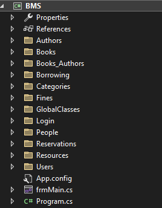
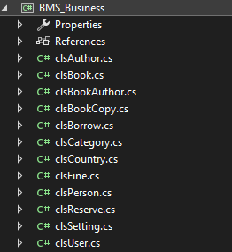
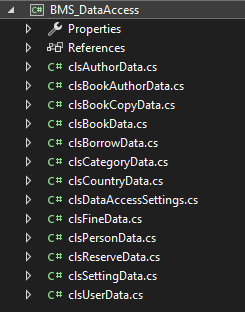
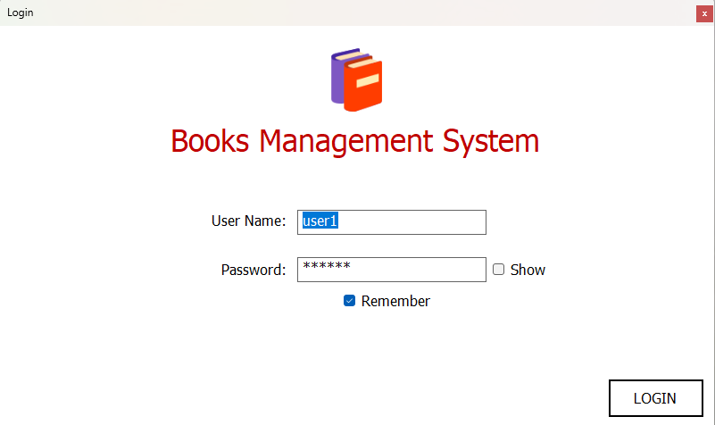
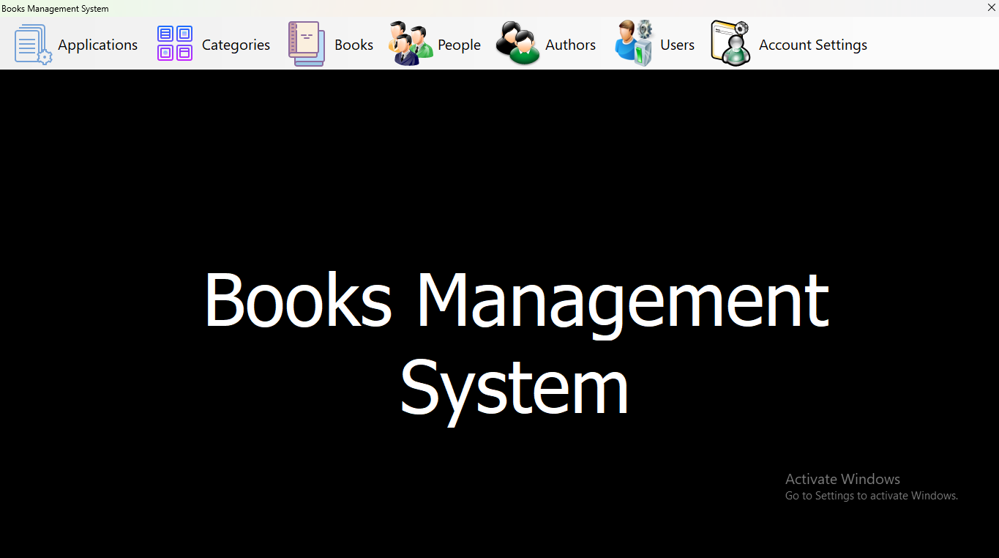
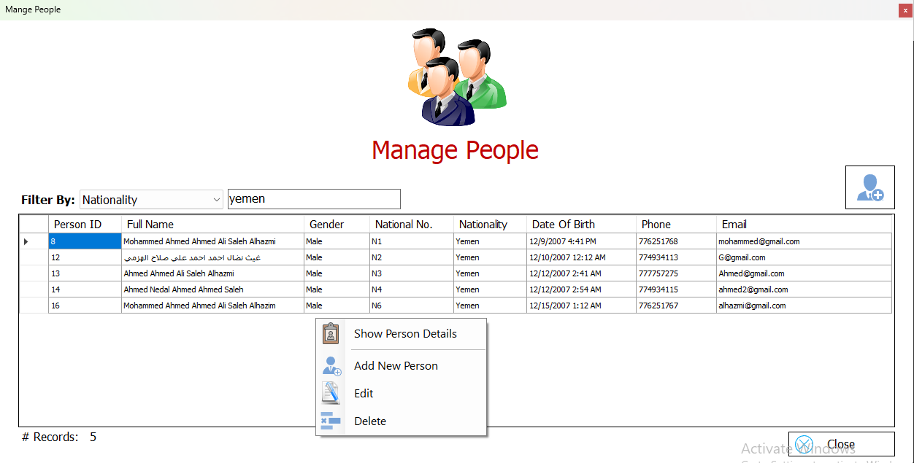
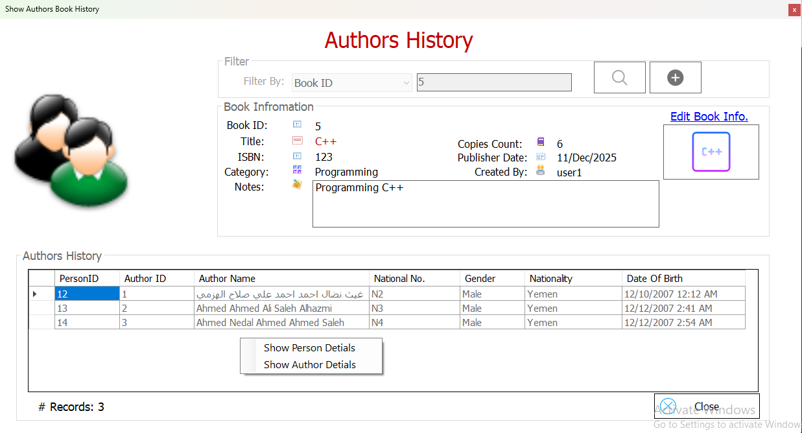
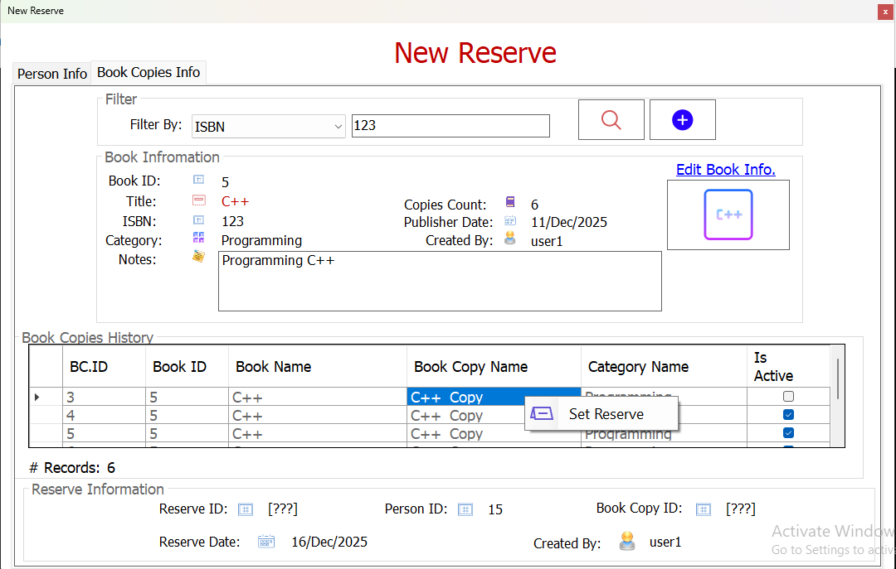

# Books Management System (BMS) 📚

### A comprehensive educational project focused on implementing 3-Tier Architecture and Software Engineering foundations using C# and SQL Server.

---

## 📖 Project Overview
The **Books Management System (BMS)** is a hands-on implementation designed to practice and master library workflows. The primary goal of this project is to apply academic concepts into a functional system, managing the lifecycle of books, physical copies, and borrowing records.

---

## 🏗️ Architectural Excellence (3-Tier)
The core focus of this project is the strict application of the **3-Tier Architecture** to practice separation of concerns:
* **Presentation Layer (UI):** Built to practice building reusable WinForms components and User Controls.
* **Business Logic Layer (BLL):** Implements business rules and entities to master OOP principles.
* **Data Access Layer (DAL):** Dedicated to practicing secure database communication using ADO.NET and Stored Procedures.

---

## ⚙️ Important Configuration (Action Required)
Since this is an educational project, some paths are hardcoded to a specific local drive. To run the project on your machine, please update the following:

1. **Database Connection:**
   - Navigate to `BMS_DataAccess` layer.
   - Open `clsDataAccessSettings.cs`.
   - Update the `ConnectionString` to match your local SQL Server instance.

2. **Image Storage Paths:**
   - The system requires two local folders to manage images. Please create them or update the paths in the source code:
   - **People Images:** `E:\DVLD_People_Images`
   - **Book Images:** `E:\BMS_People_Images`

---

## 📂 Project Structure
The repository is organized to reflect a professional development environment:

* **📁 BMS_Solution:** Contains the source code layers (`BMS_UI`, `BMS_Business`, `BMS_DataAccess`) and the `.sln` file.
* **📁 BMS_Database:** Includes all SQL scripts (Tables, Stored Procedures, and Views) and the **Relational Schema**.
* **📁 Screenshots:** Visual documentation of the system's interface and design.

---

## 🛠️ Tech Stack & Concepts
* **Language:** C# (.NET Framework)
* **Database:** Microsoft SQL Server
* **Data Access:** ADO.NET
* **Key Concepts:** OOP (Encapsulation, Classes), Layered Architecture, Component-Based UI.

---

## 📸 System Preview & Design
*Check the `Screenshots` folder for a full gallery of the UI and the Database Schema.*

| Main Dashboard | Architecture & Layers |
|---|---|
## 📸 System Preview & Design

### 1. 3-Tier Architecture Overview
This diagram shows the logical separation between the Data, Business, and Presentation layers.

---

### 2. Client Tier (UI) Structure
Details of the Presentation Layer and how User Controls are organized.

---

### 3. Business Logic Tier

---

### 4. Data Access Tier

---

### 5. Database BMS_RelationalSchema

---

### 6. Login_Screen

---

### 7. Main_Screen

---

### 8. ManagementPeople_Screen

---

### 9. AuthorsToBook_Screen

---

### 10. NewReserve_Screen 

---

## 🚀 Key Technical Achievements
This project demonstrates a solid grasp of **Software Engineering** foundations, specifically:
1. **Relational Database Design:** Normalizing data and implementing complex relationships.
2. **Layered Architecture:** Successfully decoupling the UI from data logic using a 3-Tier approach.
3. **OOP Implementation:** Writing structured C# code that follows object-oriented principles for maintainability.

---

## 👨‍💻 Acknowledgment
Special thanks to **Dr. Mohammed Abu-Hadhoud** for the invaluable guidance and for teaching the true foundations of Software Engineering.